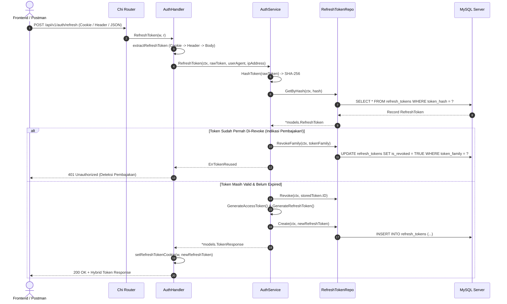

# Panduan Lengkap Memahami Proyek (Golang Learning Guide)

Dokumen ini disusun sebagai **panduan belajar komprehensif** untuk memahami arsitektur, pola desain (*design pattern*), alur eksekusi, serta idiom bahasa Go yang diimplementasikan pada **Go REST API Starter Kit (`go-crud-api`)**.

---

## 1. Peta Konsep Utama Golang pada Proyek Ini

| Konsep Golang | Lokasi Penerapan | Penjelasan Singkat |
| :--- | :--- | :--- |
| **Identitas ULID** | `internal/utils/ulid.go` | Crockford Base32 26-karakter (`github.com/oklog/ulid/v2`) menggantikan integer auto-increment, mencegah scraping ID, dan otomatis terurut kronologis. |
| **JWT & Refresh Token** | `internal/utils/jwt.go`, `internal/service/auth_service.go` | Access Token stateless HS256 (`golang-jwt/jwt/v5`) dan Refresh Token acak 64-karakter dengan hashing SHA-256 serta Refresh Token Rotation (RTR). |
| **Struct, Pointer & DTO** | `internal/models/` | Memisahkan entitas domain (`User`, `UserProfile`, `RefreshToken`, `Post`) dari DTO input (`RegisterInput`, `LoginInput`, `UpdateProfileInput`). Pointer dipakai untuk field nullable (`*string`, `*time.Time`). |
| **Interface & DIP** | `internal/service/`, `internal/repository/`, `internal/middleware/` | Layer atas bergantung pada **interface** (`UserRepository`, `UserProfileRepository`, `RefreshTokenRepository`, `AuthServiceInterface`) agar modular dan mudah di-mock. |
| **Type-Safe SQL (`sqlc`)** | `db/queries/`, `internal/repository/sqlc/` | Query SQL dikompilasi oleh `sqlc` menjadi fungsi Go yang strongly-typed tanpa overhead ORM. |
| **Embedded Assets (`embed`)** | `db/embed.go` | File migrasi SQL di-embed ke dalam binary Go dengan `//go:embed migrations/*.sql`. |
| **Goroutines & Channels** | `cmd/server/main.go` | Menjalankan HTTP server, pembersihan background token kedaluwarsa (`time.Ticker`), serta menangkap sinyal shutdown OS (`os.Signal`). |
| **Error Handling & Sentinel** | `internal/repository/`, `internal/service/` | Sentinel errors (`ErrNotFound`, `ErrDuplicate`, `ErrTokenReused`, `ErrInvalidCredentials`) dipetakan lewat `errors.Is` dan `errors.As`. |
| **Higher-Order Functions** | `internal/middleware/auth.go`, `internal/routes/routes.go` | Middleware standar `net/http` (`func(http.Handler) http.Handler`) di router **Chi**. |
| **Context & Timeouts** | `cmd/server/main.go`, `internal/middleware/auth.go` | `context.WithTimeout` untuk graceful shutdown, `context.WithCancel` untuk stop worker, dan `context.WithValue` untuk menyisipkan `user_id`, `role`, dan claims JWT. |
| **Testing & Mocking** | `internal/handlers/handlers_test.go`, `internal/service/*_test.go`, `internal/utils/jwt_test.go` | Table-driven tests, in-memory repository mocks, dan `net/http/httptest` tanpa database nyata. |

---

## 2. Struktur Proyek & Filosofi Desain

Aplikasi ini menerapkan **Layered Architecture** (`Handler → Service → Repository → Database`) berbasis *Standard Go Project Layout*:

```text
go-crud-api/
├── cmd/
│   └── server/
│       └── main.go                     # [1] Composition Root, Bootstrap server & Token cleanup
├── db/
│   ├── embed.go                        # [2] Embed file SQL migrasi ke runtime binary
│   ├── migrations/                     # [3] Skema DDL golang-migrate dengan ULID (.up.sql / .down.sql)
│   └── queries/                        # [4] Sumber query SQL untuk generator sqlc
├── docs/
│   ├── ref/
│   │   └── architecture_reference.md   # [5] Blueprint arsitektur backend untuk proyek baru
│   ├── learning_guide.md               # [6] Panduan belajar proyek (file ini)
│   ├── starter_kit_specification.md    # [7] Spesifikasi teknis, skema DB, & kontrak endpoint
│   └── postman_collection.json         # [8] Koleksi Postman v2.1 siap pakai
├── internal/                           # [9] Kode privat modul (tidak bisa diimpor modul luar)
│   ├── config/                         # Konfigurasi environment (.env / OS env)
│   ├── database/                       # Connection pool, migrate runner (-fresh), & seeder ULID
│   ├── handlers/                       # HTTP Handlers (Auth, User, Admin, Public) + httptest
│   ├── middleware/                     # JWT Auth, RequireRole, & CORS middleware
│   ├── models/                         # Domain Entities, Input DTOs, & payload validators
│   ├── repository/                     # Repository interfaces, wrapper sqlc, & dynamic SQL
│   ├── routes/                         # Chi Router, sub-routes, uploads, & rate limiter
│   ├── service/                        # Business logic, Argon2id, RTR, Goldmark Renderer
│   └── utils/                          # ULID, JWT, HashToken, response helpers
├── .air.toml                           # Live-reload config (Air)
├── .env.example                        # Template environment variables
├── api.http                            # Koleksi request untuk VS Code REST Client
├── go.mod / go.sum                     # Manifest dependensi Go
└── sqlc.yaml                           # Konfigurasi generator sqlc
```

---

## 3. Bedah Komponen Lapisan demi Lapisan

### A. Lapisan Model (`internal/models/`)

1. **`auth.go`**:
   - `TokenResponse`: memuat DTO hybrid (`access_token`, `refresh_token`, `token_type`, `expires_in`).
   - `RegisterInput` & `LoginInput`: DTO request dengan validasi regex username dan email.
   - `RefreshToken`: representasi entity token sesi di database.
2. **`user.go`**:
   - `User`: kredensial akun dengan tag `json:"-"` pada `PasswordHash`.
   - `UserProfile`: data profil personal (`FullName`, `Bio`, `PhoneNumber`, `AvatarURL`).
   - `UserWithProfile`: model agregasi JOIN untuk endpoint `/api/v1/users/me`.
3. **`post.go` & `category.go`**:
   - Entitas modul konten dengan ID string 26-karakter (ULID).

### B. Lapisan Repository (`internal/repository/`)

1. **Interface & Sentinel Errors**:
   - `UserRepository`, `UserProfileRepository`, `RefreshTokenRepository`, `CategoryRepository`, `PostRepository`.
   - Sentinel error: `ErrNotFound` dan `ErrDuplicate` (mendeteksi error MySQL 1062 via `IsDuplicateKeyError`).
2. **Penugasan ULID**:
   - Setiap method `Create()` mengecek apakah ID kosong; jika ya, memanggil `utils.NewULID()` sebelum query `INSERT` dieksekusi.

### C. Lapisan Service (`internal/service/`)

1. **`auth_service.go` (`AuthServiceInterface`)**:
   - **Register**: Validasi duplikasi email & username, hashing password dengan **Argon2id**, buat record user dan default user profile.
   - **Login**: Verifikasi kredensial Argon2id, periksa status akun (`active`), terbitkan JWT Access Token dan Refresh Token, simpan hash SHA-256 token baru ke database.
   - **RefreshToken (RTR)**: Deteksi pembajakan (*Reuse Detection*). Jika token yang dikirim statusnya sudah `is_revoked`, seluruh keluarga token (`token_family`) langsung dicabut. Jika valid, token lama di-revoke dan token baru diterbitkan.
   - **Logout & ChangePassword**: Mencabut sesi token dan membatalkan refresh token di DB.
2. **`user_service.go` (`UserServiceInterface`)**:
   - Menangani update profil personal, upload/delete avatar, dan perubahan username.

### D. Lapisan Middleware & Routing (`internal/middleware/`, `internal/routes/`)

1. **`middleware/auth.go`**:
   - `JWTAuthMiddleware`: Membaca header `Authorization: Bearer <token>`, memvalidasi signature & expiry, lalu menyuntikkan claims ke context.
   - `RequireRole`: Memastikan user memiliki role tertentu (misalnya `admin`).
2. **`routes/routes.go`**:
   - `/api/v1/auth/*`: Registrasi & login diproteksi `httprate.LimitBy` (10 req/menit per IP).
   - `/api/v1/users/*`: Seluruh endpoint user diproteksi `JWTAuthMiddleware`.
   - `/api/v1/admin/*`: Diproteksi `JWTAuthMiddleware` + `RequireRole("admin")`.

---

## 4. Alur Request Nyata (Lifecycle Walkthrough)

### Skenario: User Melakukan Refresh Token Rotation (`POST /api/v1/auth/refresh`)


```mermaid
sequenceDiagram
    autonumber
    actor Client as Frontend / Postman
    participant Router as Chi Router
    participant Handler as AuthHandler
    participant Service as AuthService
    participant Repo as RefreshTokenRepo
    participant DB as MySQL Server

    Client->>Router: POST /api/v1/auth/refresh (Cookie / Header / JSON)
    Router->>Handler: RefreshToken(w, r)
    Handler->>Handler: extractRefreshToken (Cookie -> Header -> Body)
    Handler->>Service: RefreshToken(ctx, rawToken, userAgent, ipAddress)
    Service->>Service: HashToken(rawToken) -> SHA-256
    Service->>Repo: GetByHash(ctx, hash)
    Repo->>DB: SELECT * FROM refresh_tokens WHERE token_hash = ?
    DB-->>Repo: Record RefreshToken
    Repo-->>Service: *models.RefreshToken
    
    alt Token Sudah Pernah Di-Revoke (Indikasi Pembajakan!)
        Service->>Repo: RevokeFamily(ctx, tokenFamily)
        Repo->>DB: UPDATE refresh_tokens SET is_revoked = TRUE WHERE token_family = ?
        Service-->>Handler: ErrTokenReused
        Handler-->>Client: 401 Unauthorized (Deteksi Pembajakan)
    else Token Masih Valid & Belum Expired
        Service->>Repo: Revoke(ctx, storedToken.ID)
        Service->>Service: GenerateAccessToken() & GenerateRefreshToken()
        Service->>Repo: Create(ctx, newRefreshToken)
        Repo->>DB: INSERT INTO refresh_tokens (...)
        Service-->>Handler: *models.TokenResponse
        Handler->>Handler: setRefreshTokenCookie(w, newRefreshToken)
        Handler-->>Client: 200 OK + Hybrid Token Response
    end
```

---

## 5. Menjalankan Seluruh Pengujian

Jalankan seluruh unit test dan handler integration test:

```powershell
go test -v ./...
```
